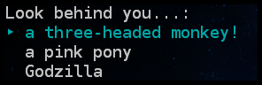
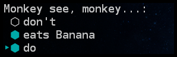
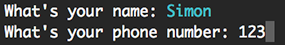
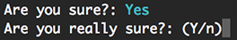

# inquirer.rb

[](https://travis-ci.org/arlimus/inquirer.rb)

Interactive user prompts on CLI for ruby.

## Prompt types

### List

```ruby
idx = Ask.list "Look behind you...", [
  "a three-headed monkey!",
  "a pink pony",
  "Godzilla"
]
# idx is the selected index
```



### Checkbox

Takes optional `default` property that define the checked options

```ruby
idx = Ask.checkbox "Monkey see, monkey...", [
  "don't",
  "eats Banana",
  "do"
], default: [true, false, true]
# idx is an array containing the selections
```



### Input

Takes optional `default` property (`string`).

```ruby
firstname = Ask.input "What's your name"
phone = Ask.input "What's your phone number", default: "123"
# name and phone are the responses for each question
```



### Confirm

Takes optional `default` property (`true` or `false`). The default `default` value is true.

```ruby
value = Ask.confirm "Are you sure?"
# value is a boolean

Ask.confirm "Are you sure?", default: false
# Default is false
```



## Options

### Method parameters

- question: `string` The text to your are going to ask
- elements: `array` Array of options to show. Only for `checkbox` and `list` types.

### Rendering options

You can pass this options as the lastest parameter

- clear: `bool` [Default true] Clear the original question after pressing enter
- response: `bool` [Default true] Whether to show the selected response

```ruby
# If you dont want any output use
Ask.input "What's your name", response: false

# If you don't want the response and you want to keep the question prompt
Ask.input "What's your name", clear: false, response: false
```

## Installation

    gem install inquirer

## Compatibility

|      Ruby      | Linux | OS X | Windows |
|----------------|:-----:|:----:|:-------:|
| MRI 1.9.3      | ✔     | ✔    | ✘       |
| MRI 2.0.x      | ✔     | ✔    | ✘       |
| MRI 2.1.x      | ✔     | ✔    | ✘       |
| MRI 2.2.x      | ✔     | ✔    | ✘       |
| Rubinius 2.5.x | ✔     | ✔    | ✘       |
| JRuby 1.7.x    | ✘     | ✘    | ✘       |

## Contributors

**Thank you for contributing!**

*  [blackjid](https://github.com/blackjid)

## Credit

This is basically the wonderful [Inquirer.js](https://github.com/SBoudrias/Inquirer.js), just done for ruby. I was unable to find a good gem to handle user interaction in ruby as well as this module does in JS.

## License

Apache v2
Author: Dominik Richter
